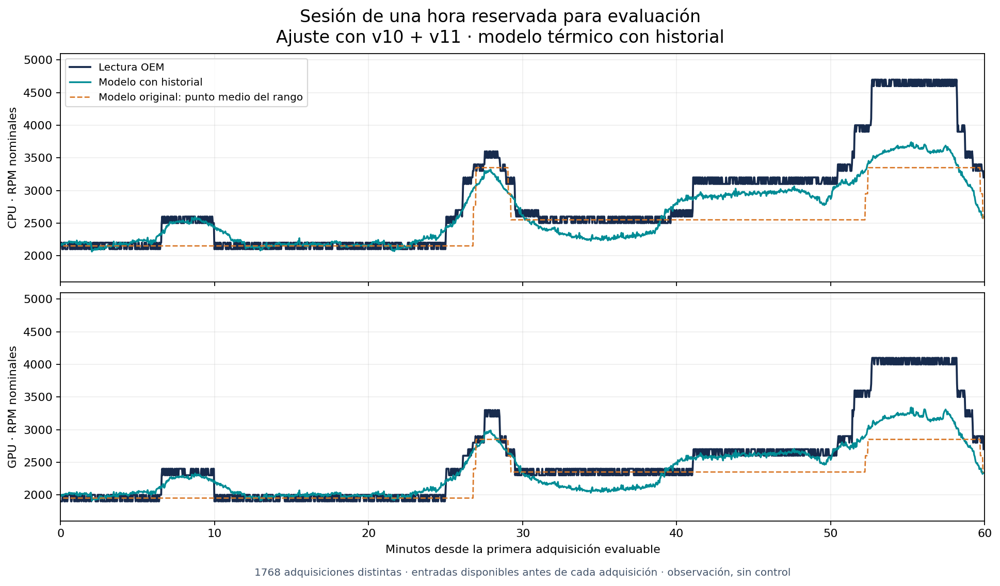

# Comparación de modelos OEM — 8 de octubre de 2026

## Conclusión de ingeniería

El historial térmico mejora la predicción respecto de usar solo temperaturas
instantáneas. Los modelos estudiados siguen sin explicar suficientemente el
régimen alto de ventilación ni ofrecen un sustituto cualificado del firmware.
Añadir DTT1/DTT2 no produce una mejora consistente en estas sesiones. No se
modifica el control de ventiladores ni se instala un modelo en la GUI.

Los datos actuales bastan para esta conclusión y para reproducir la comparación.
No hace falta otra captura para demostrar los fallos ya presentes. Un candidato
futuro necesitará evaluación independiente antes de cualquier promoción a control.

## Protocolo reproducible y límites

Se utilizan las entradas originales, verificadas por SHA256, de v10, v11 y la
captura de una hora del 8 de octubre. Cada evaluación reserva una sesión completa,
ajusta con las otras dos y selecciona hiperparámetros mediante dos evaluaciones
internas: entrenar en una de esas dos sesiones y evaluar en la otra.

Cada sesión de entrenamiento tiene el mismo peso total. No se reparten al azar
filas de una misma sesión entre entrenamiento y evaluación. La familia elegida
en cada reserva depende de las evaluaciones internas, no del error de esa reserva.
Los resultados por familia son comparaciones descriptivas; elegir posteriormente
la familia con el mejor promedio externo introduciría optimismo de selección.

El objetivo es el par de niveles **real**, incluyendo los niveles no modelados.
Cada adquisición fresca de ventiladores aparece una sola vez. Las características
deben haber estado disponibles antes de su adquisición: se toma el último frame
registrado con timestamp <= epoch del ventilador y se exige frescura de las fuentes
tanto en ese frame como en la adquisición. No se usa información térmica posterior
para explicar una lectura anterior. Las RPM observadas nunca entran en el predictor.

Se comparan una media constante, regresiones regularizadas y árboles pequeños.
Las entradas primarias son max(CPU package, core max), GPU, TZ01 y DTT3. El historial
añade medias exponenciales causales de 30/120 segundos, máximo de los últimos
120 segundos y diferencia respecto de la media de 30 segundos. Un hueco mayor a
cinco segundos o una fuente inválida reinicia ese historial. La integración usa
el valor previamente disponible, sin extender retroactivamente una lectura nueva.

La selección interna minimiza el promedio entre sesiones de:

`MAE de ambos ventiladores + 0,5 × subestimación media del peor ventilador`.

Es un criterio de investigación, no una condición de seguridad. Los valores
predichos se limitan a 0–100 niveles, no a los máximos observados en entrenamiento.
Los árboles no pueden aprender salidas superiores a los ejemplos disponibles;
las regresiones pueden extrapolar, pero eso no demuestra que lo hagan correctamente.

Los experimentos con DTT1/DTT2 se añadieron **después** de inspeccionar la primera
comparación. Sus resultados se identifican como exploratorios, aunque el ajuste
y la selección interna también excluyen los objetivos de la sesión reservada.
Las fuentes DTT1/DTT2 estaban frescas siempre que las cinco fuentes primarias
lo estaban en las adquisiciones utilizadas: el conjunto evaluable no cambió.
Los resultados numéricos de las seis familias primarias permanecieron idénticos.

Las tres sesiones pertenecen al mismo equipo y ya habían sido inspeccionadas
durante la investigación. Esta es una validación retrospectiva separada por sesión,
no una cualificación física independiente. Los epochs térmicos históricos de
v10/v11 aproximan la adquisición; los de la captura nueva conservan el inicio de
consulta. No se imputan fuentes vencidas. Potencia y carga no entran en estos
modelos: no tienen epochs independientes en las entradas y CPU load está ausente
en la sesión nueva. Modo OEM, potencia, otros sensores y memoria más larga siguen
siendo posibles explicaciones adicionales.

## Cobertura de datos

| Sesión | Adquisiciones frescas distintas | Objetivos con entradas causales frescas | Cobertura |
| --- | ---: | ---: | ---: |
| v10 | 1409 | 913 | 64,80% |
| v11 | 372 | 366 | 98,39% |
| 8 de octubre | 1769 | 1768 | 99,94% |

Los rechazos se conservan en el informe. La cobertura menor de v10 limita sus
conclusiones: el error no representa los intervalos sin entradas utilizables.
La validación requiere todas las fuentes; no supone una predicción baja cuando faltan.

## Comparación primaria

Error absoluto medio de ambos ventiladores, convertido a RPM nominales mediante
100 RPM por nivel. No equivale a una medición de tacómetro más precisa que la
resolución del backend.

| Familia | v10 reservada | v11 reservada | Hora nueva reservada | Promedio entre sesiones |
| --- | ---: | ---: | ---: | ---: |
| Media constante | 375 | 393 | 508 | 425 |
| CPU/GPU instantáneas, lineal | 376 | 280 | 351 | 335 |
| CPU/GPU/TZ01/DTT3 instantáneas, lineal | 348 | 210 | 320 | 293 |
| Térmico con historial, lineal | 281 | 210 | 224 | 238 |
| Térmico instantáneo, árbol | 443 | 191 | 336 | 324 |
| Térmico con historial, árbol | 299 | 174 | 232 | 235 |

La selección interna primaria eligió lineal instantáneo para v10, árbol con
historial para v11 y lineal con historial para la hora nueva. Su promedio externo
fue **249 RPM**, con un 53,4% de adquisiciones dentro de ±200 RPM en ambos
ventiladores. El valor 235 RPM de la mejor familia descriptiva no se presenta como
el resultado de una selección independiente de las reservas.

## Régimen alto: el promedio no basta

La hora nueva se evalúa ajustando solo con v10/v11. El modelo primario seleccionado
fue el lineal con historial (`alpha=0.1`, variables normalizadas exclusivamente
con las sesiones de ajuste). En las 1768 adquisiciones:

- Error medio: **224 RPM**.
- Algún ventilador al menos 500 RPM por debajo: **13,63%**.
- Algún ventilador al menos 1000 RPM por debajo: **6,22%**.

Para las **213** adquisiciones con CPU >=39 niveles o GPU >=35 niveles:

- Error medio: **884 RPM**.
- Algún ventilador al menos 500 RPM por debajo: **100%**.
- Algún ventilador al menos 1000 RPM por debajo: **51,64%**.

Las sesiones de ajuste alcanzaban como máximo 40/36 niveles. La hora reservada
alcanzaba 47/41; **166** adquisiciones estaban fuera del rango de salidas visto en
el ajuste. No se incorporaron esos objetivos al entrenamiento para mejorar el
resultado de la misma reserva. v11 no contiene ejemplos del estrato alto: su
resultado correspondiente es `null`, no un éxito.



El modelo original también se evaluó con sus rangos convertidos a puntos medios,
en los mismos snapshots causales. En las 1763 adquisiciones nuevas para las que
no se abstuvo, su error fue 310 RPM, frente a 225 RPM del candidato en ese **mismo
subconjunto**. La subestimación de al menos 1000 RPM bajó de 11,51% a 6,24%.
En cambio, en las 360 adquisiciones comparables de v11, el original obtuvo 90 RPM
frente a 176 RPM del candidato seleccionado. La sustitución no mejora todas las
sesiones. v10 también conserva explícitamente las abstenciones del modelo original.

## Qué aportan DTT1/DTT2

En dos snapshots causales, CPU=55 C, GPU=40 C, TZ01=58,05 C y DTT3=45 C coincidían,
pero los ventiladores eran 22/19 en v10 y 35/32 en la hora nueva. DTT1/DTT2
diferían (47/42 frente a 55/55 C). Esa observación motivó la extensión exploratoria;
no demuestra por sí sola qué señal gobierna al firmware.

Al incorporar DTT1/DTT2 actuales y su historial, el error del lineal con historial
en la hora reservada fue **228 RPM**, frente a 224 RPM sin esas entradas. Las
subestimaciones de 1000 RPM fueron 6,67%, frente a 6,22%. Otros árboles cambiaron
poco. No hay una mejora consistente que justifique declarar resuelta la lógica
OEM con esas señales adicionales.

## Resultado y decisión

1. Se descarta la hipótesis de que el modelo inicial A–D y sus temporizadores
   actuales sean una reconstrucción suficiente del comportamiento observado.
2. El historial térmico es una dirección mejor sustentada que las temperaturas
   instantáneas para continuar un predictor **shadow**. No se identifica una
   duración OEM exacta ni un único conjunto de reglas a partir de estas pruebas.
3. Ninguno de los candidatos evaluados se promueve a control. El fallo en el
   régimen alto persiste y la mejora media no lo compensa.
4. Si el objetivo de producto es una ventilación propia, suave y conservadora,
   conviene diseñar esa política explícitamente con límites térmicos, disponibilidad
   de sensores, histéresis, respuesta de subida y recuperación existentes. El ajuste
   estadístico de la curva OEM no debe convertirse automáticamente en su política
   de seguridad. No se realiza esa integración en este cambio.

## Reproducción y verificación

Los informes JSON conservan los modelos ajustados, parámetros, puntuaciones
internas, errores de cada reserva, cobertura y diagnósticos de soporte:

- [Comparación primaria](oem-shadow/model-comparison-primary-2026-10-08.json).
- [Comparación con extensión exploratoria](oem-shadow/model-comparison-context-2026-10-08.json).

```sh
python -m pip install -r scripts/oem-shadow-research-requirements.txt
python scripts/evaluate-oem-shadow-models.py --self-test
python scripts/evaluate-oem-shadow-models.py --fixtures tools/OemShadow/fixtures --baseline-root artifacts --output comparison
python scripts/check-oem-shadow-models.py tools/OemShadow/fixtures comparison
```

`artifacts/oem-v10`, `artifacts/oem-v11` y `artifacts/oem-live` deben contener los
replays producidos por el workflow OEM. La salida debe ser un directorio nuevo.
Sin `--baseline-root` también se comparan los candidatos, pero no el modelo original.
La figura se reproduce con `plot-oem-shadow-model-comparison.py comparison figura.png`
y matplotlib 3.10.8; es una dependencia opcional de presentación.

El self-test verifica independencia de etiquetas de ventiladores, cambios futuros,
aislamiento de la reserva completa, epochs cacheados, fuentes ausentes/vencidas/futuras,
reinicio del historial después de un hueco y expiración entre snapshot y adquisición.
Un comprobador separado recalcula errores, percentiles, subestimaciones, estratos,
objetivos crudos y selección interna. El workflow lo ejecuta en Windows y Ubuntu,
además de las comprobaciones existentes del capturador. Pasar esas comprobaciones
verifica el evaluador; **no cualifica los modelos para controlar hardware**.
